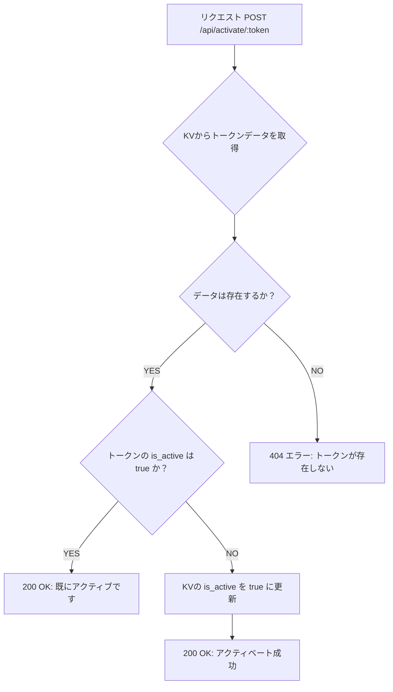
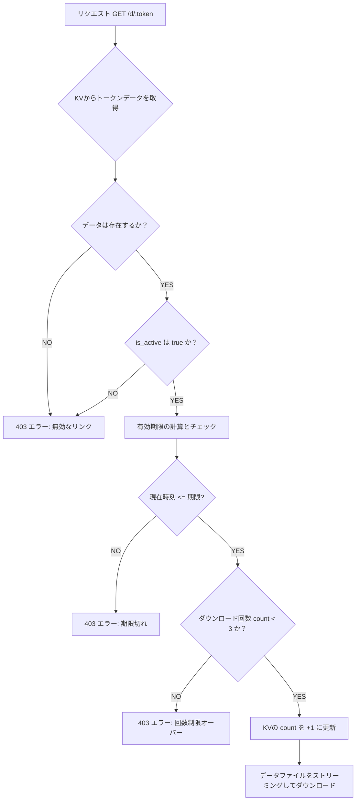

ご要望に基づき、Hono APIの仕様、実装フローチャート、および管理者ツールの仕様定義を作成します。

## 📄 Hono API 仕様書

このシステムは、**Vercel KV**をデータベースとして利用し、3つの主要なエンドポイントで構成されます。

| エンドポイント | メソッド | パス | 説明 | 備考 |
| :--- | :--- | :--- | :--- | :--- |
| **事前生成** | `POST` | `/api/generate_pre_sale_tokens` | イベント前に販売予定のトークンを生成し、KVに非アクティブ状態で保存します。 | 管理者ツールでのみ使用 |
| **アクティベート** | `POST` | `/api/activate/:token` | 現金支払い後、指定されたトークンの`is_active`を`true`に設定します。 | 管理者ツールでのみ使用 |
| **ダウンロード** | `GET` | `/d/:token` | 購入者がアクセスし、回数制限と有効期限をチェック後、ファイルをダウンロードさせます。 | 購入者が使用 |

### 1\. トークン事前生成（`POST /api/generate_pre_sale_tokens`）

| 項目 | 詳細 |
| :--- | :--- |
| **リクエストボディ** | `{"count": 100}` (生成したいトークンの数) |
| **処理** | 1. `count`個のユニークなトークンを生成。 2. 各トークンを`{"is_active": false, "count": 0}`としてKVに保存。 |
| **レスポンス** | ステータス `200 OK` と、生成されたトークンとダウンロードURLのリスト。 |

```json
[
  {
    "token": "abcde12345fg",
    "download_url": "https://yourdomain.com/d/abcde12345fg"
  },
  // ... 他のトークン
]
```

### 2\. トークンアクティベート（`POST /api/activate/:token`）

| 項目 | 詳細 |
| :--- | :--- |
| **リクエストパス** | `/:token` (アクティベートするトークン) |
| **処理** | 1. KVからトークンのデータを取得。 2. `is_active`を`true`に更新し、KVに保存。 |
| **レスポンス** | ステータス `200 OK` と成功メッセージ。 |

```json
{
  "status": "success",
  "message": "Token abcde12345fg has been activated for sale."
}
```

### 3\. ダウンロード処理（`GET /d/:token`）

| 項目 | 詳細 |
| :--- | :--- |
| **リクエストパス** | `/:token` (ダウンロードに使用するトークン) |
| **処理** | 1. **販売済みチェック:** `is_active: true`か確認。 2. **有効期限チェック:** 環境変数`EVENT_DATE`に基づき、現在時刻が翌日の23:59:59を過ぎていないか確認。 3. **回数制限チェック:** `count < 3`か確認。 4. 全て合格なら`count`を\*\*+1\*\*してKVに保存し、ファイルをストリーミング。 |
| **レスポンス** | **成功:** データファイル（`application/zip`など）のストリーミング。 **失敗:** ステータス `403 Forbidden` とエラーメッセージ。 |

```json
// エラーレスポンスの例
{
  "status": "error",
  "message": "このダウンロードリンクは期限切れです。"
}
```

-----

## 📊 Hono API 実装フローチャート

### A. トークンアクティベート（`/api/activate/:token`）フロー



-----

### B. ダウンロード処理（`/d/:token`）フロー



-----

## 🛠️ 管理者側アクティベートツール仕様定義

### 目的

イベント当日の現金支払いを確認した後、印刷済みのQRコードを読み取り、対応するトークンを\*\*非アクティブ（`is_active: false`）**から**アクティブ（`is_active: true`）\*\*に切り替えるための、ブラウザベースのツール。

### 動作環境

  * **プラットフォーム:** Webブラウザ（PCまたはスマートフォン/タブレット）
  * **技術スタック:** HTML, JavaScript, CSS (外部ライブラリとしてQRコードスキャナーライブラリを使用)
  * **通信先:** 作成したHono APIの`/api/activate/:token`エンドポイント

### 主要機能

1.  **Webカメラアクセスとプレビュー:**
      * ブラウザのWebカメラ機能を利用し、ライブ映像を表示します。
      * ユーザーがカメラへのアクセスを許可する必要があります。
2.  **QRコードスキャン:**
      * カメラの映像からQRコードをリアルタイムで検出し、内部のURLを解析します。
      * URLから**トークン部分のみ**を抽出します。（例: `https://yourdomain.com/d/abcde12345fg` から `abcde12345fg` を抽出）
3.  **アクティベーションAPI呼び出し:**
      * 抽出したトークンを使用して、Hono APIの\*\*`POST /api/activate/:token`\*\*エンドポイントを呼び出します。
4.  **結果表示:**
      * APIからのレスポンス（ステータスコードとメッセージ）を画面に表示します。
          * **成功:** 「アクティベート完了！」と緑色で表示し、次のスキャンを待機。
          * **失敗:** 「アクティベート失敗（既に有効/トークン不明）」と赤色で表示。

### 画面構成案

| 要素 | 説明 |
| :--- | :--- |
| **カメラビュー領域** | Webカメラの映像をリアルタイムで表示するエリア。 |
| **ステータス表示** | 現在のカメラの状態（初期化中/スキャン中）や、APIの結果を表示する大きなテキストエリア。 |
| **手動入力フォーム** | QRコードが読み取れない場合に備え、トークンを手入力し、アクティベートを実行するためのボタン。 |
| **履歴リスト** | 直近でアクティベートに成功したトークンのリストを表示し、誤って二重アクティベートしていないか確認できるようにする。 |
