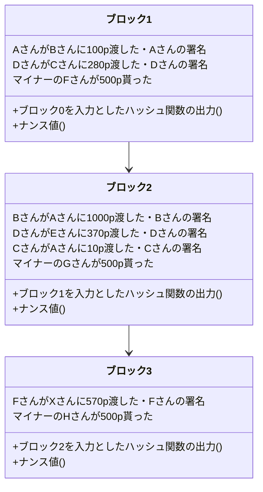
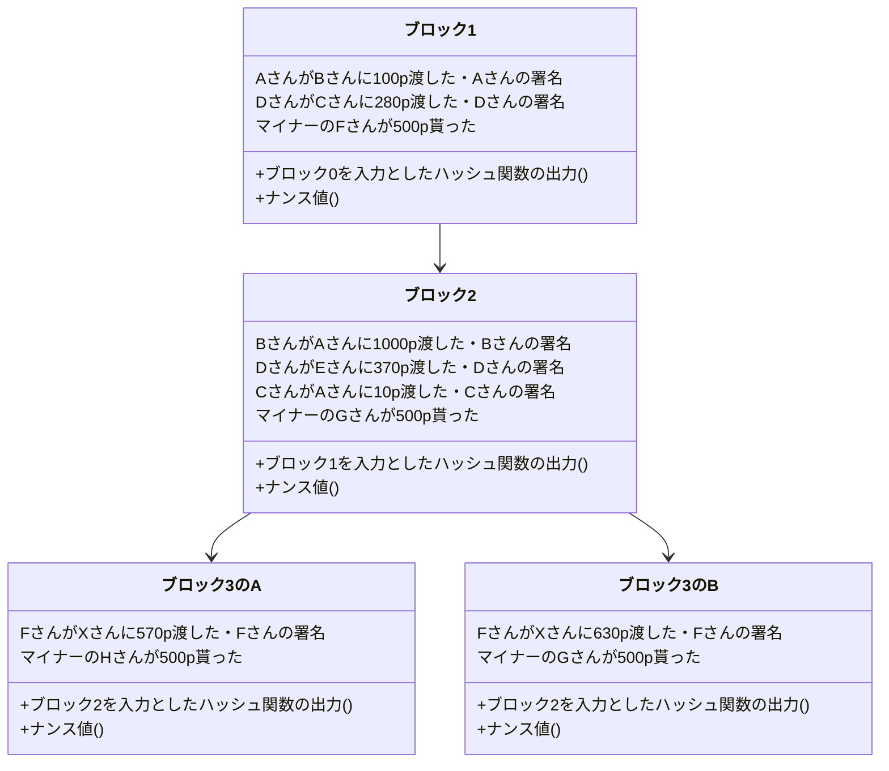

# 僕の考えた最強のWeb3

**仮想通貨への投資を勧める記事では決してありません**

まずは分散型システムと暗号化技術の代表として仮想通貨やその周辺の分散型システムの仕組みについて説明していきます。仮想通貨に管理にはブロックチェーンという技術が使われています。そのブロックチェーンについて説明してきます。
そもそも、仮想通貨を実現するにはどうすればいいかというと、
「人がその通貨をやり取りしたことを正確に記録する信頼できる台帳」を作ればいいです。そうしたらそれぞれの人の持っている通貨の量を一意的かつ信頼を持って言うことができます。
しかし台帳を誰か特定の人(例えばサービス管理運営者が持っていると)、その運営者を信頼しないといけなくなって仮想通貨システムとして成立しないです。よってサービスを利用しているユーザー全員が共同で台帳を管理していちいち同期するようにすればいいというわけです。

ここで前提知識としてハッシュ関数を説明します。ハッシュ関数とは、様々なデータを入力値として与えると、0と1の数の並びが出力される関数です。
性質にはこんなものがあります。
1、入力値を少しでも変えると全く違うものが返ってくる。
2、ある01の並びを出力するような入力を答える時に、「いろんな入力をしてみてその並びと等しいものを探す」という方法より効率的な方法をまだ人類が知らない。
イメージは素因数分解です。
例えば、37*31=1147だったら暗算はできなくても筆算を書いたらすぐすることができます。しかし、1147の素因数は？という問いに答えるのは結構大変です。具体的には割る2・割る3・割る5というように小さい素数から割り切れるかを確認していく必要があります。sqrt(1147)までの素数で全て割り算したら絶対に1147がどのように素因数分解されるかを言うことができます。よって入力される大きな素数っぽい数のスケールの二乗根に比例した回数の割り算をしないといけなくなります。しかし逆向きは1回の計算で済みます。
ちなみに素因数分解と今回システムに使っているハッシュ関数(SHA256と言う)は全く関係ないですが、素因数分解を利用した暗号化技術にRSA暗号があり、Webサイトなどにアクセスする時にも実際に使われています。ちなみに量子コンピュータが話題になっているのは、「ある01の並びを出力するような入力を答える」問題を効率的に解ける(あくまでも)可能性があるからです。

今度は公開鍵暗号について説明します。一般的に思いつく暗号化の方法は、秘密鍵暗号と呼ばれるもので次のように行われます。秘密鍵暗号では「平文→暗号」と「暗号→平文」は同じ鍵を使って行います。秘密鍵が漏れると解読されてしまいますから、どうにか最初に秘密鍵を何らかの安全な環境で送り届ける必要があります。これとは対照的に公開鍵暗号では、「平文→暗号」と「暗号→平文」は異なる鍵で行います。「平文→暗号」には公開鍵を、「暗号→平文」には秘密鍵を使います。さっきのハッシュ関数と同じように、暗号化はできるけどその暗号を解読しろといわれてもいろんな平文を暗号化してみるという方法よりも効率的な暗号の解き方が存在しないというものです。そうするとそもそもバレたら困る鍵を渡す必要がありませんから安全というわけです。現実的にはこの公開鍵暗号は計算に大変な時間がかかるので、秘密鍵暗号の秘密鍵だけ公開鍵暗号で安全に届けそのあとは秘密鍵暗号で通信するというハイブリッドな方法が使われています。

まずは前提知識としてデジタル署名について解説します。デジタル署名とは「誰かが承認していることを証明するもの」です。デジタル署名はハッシュ関数を使って実現できます。Aさんが承認しているということをBさんが確認するということを考えると、次のようなアルゴリズムでデジタル署名が行われます。
ここでは、
- 署名は鍵があればすぐに生成することができる
- 署名は鍵がなければ生成することは難しい
- 署名は鍵がなくてもそれが正しいことがすぐわかる

ような関数`f`を使います。

`※一部説明の都合上簡略化しています。`

1. Aさんが関数`f`と鍵を使って「承認した」という旨のメッセージを署名にし、公開します。
2. 署名をBさんが見て関数`f`を使って正しさを証明できます。なぜなら正しい署名を作れる人はAさんだけだからです。

それでは、これからブロックチェーンというアイデアを再発明していきましょう。そのステップを見ることでこのアイデアの素晴らしさがわかってくると思います。

まずは台帳を署名を使って作っていくということを考えてみます。台帳とはここでは仮想通貨の所有者の取引の記録です。具体的には以下のようなものです。
```
- AさんがBさんに100p渡した
- DさんがCさんに280p渡した
```
これらをどこかに溜めていきます。そうしたら全ての取引を正しくきちんと把握することができるようになるはずです。しかしこのメカニズムには致命的な欠陥が複数あります。
- 中央集権的であること。
- 順序がわからないこと。

中央集権的であるとそれ用のサーバーを使っている人が不正をしていないことを証明するのが非常に難しくなります。新しい取引を勝手に作ることはデジタル署名的に不可能だったとしても何らかの取引を隠蔽することは簡単にできてしまいます。またもしこのサーバーが落ちたら仮想通貨は使えなくなってしまいますし、多大な運用コストがかかります。

また、順序がわからないと残金が100pなのに、40pと80pの買い物を同時にすることが可能になります。どちらかができないようになるべきですが、それを防ぐ方法がありません。逆にいうと順序を保証できたらこの問題は解決します。

よって仮想通貨を使う人全員で、順序を持った台帳のコピーを持ち合いそれぞれが正しさを検証すれば良さそうです。しかしそれでは誰かが「自分が100pもらう」という取引を勝手に追加したときに、それが広がってしまいます。またほとんど同時に行われた取引の順序を決めることが難しいです。

そこでブロックチェーンを導入します。

ブロックチェーンとは一言で言うなら「台帳を全員で安全に管理する仕組み」です。
```
AさんがBさんに100p渡した
DさんがCさんに280p渡した
```

このような台帳があれば誰が何p持っているのかわかります。しかしその台帳が正しいことをみんなで保証しようという仕組みが必要です。

ひとまずなぜこのようなルールなのかわかなくてもいいので、全体像を把握しましょう。

台帳をひとまとまりに分けてブロックという単位で管理することにします。ブロックの中には、以下の図のように複数の通貨のやり取りの記録それに対応するデジタル署名と、一個前のブロックを入力とした時のハッシュ関数の出力(ハッシュ)と、ハッシュがたまたま00000から始まるハッシュ関数の入力(ナンス値)が入ることにします。
実はこのブロックの列(ブロックチェーン)は枝分かれすることもありますが、クライアント(仮想通貨を使う人)は最も長いブロックチェーンを信用します。



さて、この構造にしたらなぜこの台帳が改竄されていないことがわかるのかを説明していきます。
まずはブロックの`k`番目について考えていきます。

`k`番目のブロックには、`k-1`番目のブロックのハッシュ値及び取引情報(コンテンツ)が最初に入っています。コンテンツの長さが一定の数値を超えるとナンス値が生成されます。コンピュータ資源を活用して頑張ってたまたま00000から始まるハッシュ値の入力側を探します。この操作はマイニングと呼ばれます。マイニングをしているマイナーは世界にたくさんいて、早い者勝ちで自分の作ったナンス値をブロックの中に入れることができます。ナンス値が見つかったら今度は`k`番目のブロックのハッシュ値が取られて取引情報がどんどん書き込まれていきます。その後は同じ手順です。この時マイナーのなかで最初にナンス値を見つけられた人は一定の仮想通貨上での金額を受け取ることができます。なのでみんなマイニングをしようとするわけですね。これは仕組み上必須なことと捉えることもできますが、仮想通貨の発行源と見ることもできます。ちなみにこの時、具体的な情報を何も提供していないのにマイニングをしたことが証明されているのでこれは不思議だということで「プルーフオブワーク」と言われています。

台帳を改竄するには、正しいブロックチェーンとは別の、自分が有利なコンテンツを書き込んだブロックチェーンを作る必要があります。しかし、それは先ほど説明したデジタル署名の仕組みによって不可能になっています。

ではデジタル署名だけでは解決できなかった存在保証と順序性の保証をどう解決するかを解説します。例えばたまたま同時にブロックが繋げられ、分岐してしまったとします。



そうすると、マイナーたちは確率的にどちらのブロックの後にブロックを繋げるかを決め、いつも通りマイニングをします。するとどちらかが1つだけ伸びます。そうするとその伸びた方が正しいブロックチェーンとマイナーの間でみなされその後に全てのマイナーがブロックを繋げようとしようとします。するとどれか一つのブロックチェーンが正しいものとして同期されます。

ここで間違った取引が含まれているようなブロックは、マイナーがそのブロックの有効性を確認してからマイニングを行うため次にブロックが繋がることがありません。
また正しい取引も最短でその唯一のブロックチェーンに取り込まれないかもしれませんが、チェーンに入っていない取引情報も未認証ながら全体で共有されますから、次のブロックに入ることができるわけです。それが無理ならまたその次のブロックに...

ここで、攻撃者の気持ちでこのシステムをもう一度見てみましょう。攻撃者のしたいことは主に2通りです。

- 勝手に取引を追加する
- 既存の取引の時間的順序の入れ替え・取引の削除

取引を勝手に追加することはデジタル署名の仕組みの上できません。デジタル署名はその有効性の証明は簡単にできるが、有効な署名を新しく作るのは非常に難しいという性質を持っていました。

既存の取引の時間順序の入れ替え・取引の削除は、ブロックチェーン上の理由からできません。もし昔のブロックを入れ替えるとします。そうするとハッシュ値の性質からその次のハッシュ値が変わってしまうので、その次のハッシュ値も変わって...となり、その以後のブロックのナンス値を全て自分で作っていく必要があります。またクライアントは最も長いブロックチェーンが正しいと判断するため、その攻撃者の作ったブロックチェーンを他のブロックチェーンとブロックを繋げる作業の競争をする必要があります。これは、この仮想通貨のマイナーの計算資源の50％以上を確保することが必要でこれはほとんど不可能です。なぜなら攻撃者以外のマイナーは攻撃者の作ったチェーンが正しくないことを確認しそれにブロックを繋げることは全くないからです。

ブロックチェーンを理解できましたか？僕はいつもこのようなよくできたアイデアに触れると、複雑かつ単純というどこか逆説的な感覚に陥ります。わからなかったら間を空けてもう一度読んでみてください。どうしてもわからなければ、僕なんかよりもうまく説明している動画がありますのでぜひご覧ください。

[https://youtu.be/o-xhOBn4S60?si=Ihoy3rWDtMi7qE09](https://youtu.be/o-xhOBn4S60?si=Ihoy3rWDtMi7qE09)

ここからはブロックチェーンを代表とするWeb3についてということでよりミクロな話・この方式のブロックチェーンの課題とその改善・メタバースでの応用・自分的Web3について話していきます。

まず現在のインターネットの世界というのは、Web2といわれます。

- Web1: 情報が一方的にサーバーからクライアントに流れていく
- Web2: サーバーを経由してクライアント同士がインタラクトする（中央集権的）
- Web3: 直接クライアント同士がインタラクトする（分散型）

ブロックチェーンというのはズバリWeb3の技術です。現在のシステムというのは大抵サーバーがメインとなってクライアントを操るという構成になっています。しかしそれではサーバーにその分負荷がかかりますしエッジデバイスの計算資源を有効活用することが難しいです。またサーバーが何らかの不具合で止まった時に全てのシステムが止まってしまいます。そこで主体をクライアントに分散させることで安定・次世代的なインターネットを作ろうというのがWeb3の思想です。

Web2で使われていたのは主にHTTP(S)通信でこれは`Hyper Text Transport Protocol(Secure)`の略です。ここでの`Hyper Text`とはHTMLなどの文書形式のことで、枯れた技術ですがあくまでも情報提供のためのプロトコルであり色々な意味での限界があります。

> ここでは簡略化のためWebというプラットフォームの問題をHTTP(S)になすりつけています。有識者の方は適宜HTTP(S)を`Web標準`に置き換えてください。HTTP(S)というのはあくまでもTCPの上に載った薄いラッパーです。

> 「枯れた」というのは長年使われてきたおかげで信頼性がありよく出回っているという良い意味です。Webはもちろん現在も活発で更新され続けていますが「枯れた」ということもできるだろうというのが僕の意見です。
 
大きな問題点の一つにXMLの重さ・ブラウザで動くプログラミング言語であるJavaScriptの根本的な速度限界・ブラウザの開発複雑化などがあると思います。それの解決の一つに僕は、WASIとP2P通信(もしくは同種の次世代プロトコル)の組み合わせを推しています。

まずは現状を理解するところから始めましょう。現状のWebは僕からするとすでに後方互換性のせいで良くも悪くも「継ぎ接ぎ状態」です。

Webは、Html(とcss)とJavaScriptで構成されます。Htmlは実はXMLを継承している言語で、XMLというのは昔使われていたデータトランスポーターです。今はほとんどJSONになっていますね。JSONはXMLに比べて軽量でパースしやすいという性質がありこれが代替となった理由です。

> データトランスポーター(独自定義)：データを通信しあうためのファイル形式のこと

> パース：ファイルを読み込み機械が扱えるような状態に変換すること

> XML：`<data name="名前？">ほにゃらら</data>`のような形式のこと

> JSON：`{ data: {name: "名前？", children: "ほにゃらら"}}`のような形式のこと。

> ちなみにGoogle開発の*Protocol Buffers*というより挑戦的な技術があります。これはテキストではなくバイナリで保存することでパース処理をなくして高速化しようという何方かと言えば組み込み開発的なアプローチのデータトランスポータで、スキーマがないと動かない代わりにその分最適化してくれます。現代は静的型がトレンドなのでスキーマ必須でもみんな使いそう...
> 詳しくは公式ドキュメント(英語)をどうぞ：https://protobuf.dev

> バイナリ：0と1で表す形式のこと。テキスト形式よりも効率的・軽量な傾向がある。機械が直接理解できる。

> スキーマ：データの構造を事前に示しておく時に使われる。英文における英文法のような存在。スキーマ必須の場合、ある程度の不自然さができるがその分セキュリティカル。最近トレンド。

> 型：データをどのような形でメモリに格納するかの形式のこと。「静的型」の場合、柔軟性低く・速く・安全で、「動的型」の場合、柔軟性高く・遅く・危険な傾向がある。「静的型」がトレンド。

JSONを継承したマークアップを作るのもいいと思いますが、マークアップとして使うなら最適かつ互換性もありAIとの相性もいいMD(MarkDown)という形式があります。

> マークアップ：ドキュメントを構成するためのファイル形式全般のこと

それはさておき、僕は宣言的なマークアップ言語なんていらないと考えていて、手続き的なUI構成WASIを宣言的マークアップ言語からビルド時生成すればいいのです。

>UI：ユーザーインターフェースの略。ここではデバイスで見るグラフィカルなインターフェースを指す。

>WASI: ブラウザで動くポータブルなバイナリ形式で保存できるプログラムである*WASM*(*WebAssembly*の略)が外部インターフェースを規格化した結果、ブラウザから飛び出し*WASM Runtime*という種のソフトウェア上で動くプログラムおよびその規格のこと。

> ポータブル：この場合、あらゆる環境(パソコン・スマホ)などで動くという意。

>外部インターフェース：OS・アーキテクチャ依存の部分の意。

>アーキテクチャ：平たくいうとCPUの種類のこと。(本当はソフトウェアレベルで定義されているCPUの種類のこと。)

>手続き的・宣言的：僕の書いた別の記事「日常へIT設計という概念を持ち込んでみる」を参照。

>ビルド時生成する：開発側のコンピュータで変換し変換結果をデバイスに配信するというアプローチのこと。

またJavaScriptというものは必要ありません。TypeScriptなどのように開発時に型が必要というのは痛いほどわかりますが、ビルド時に型情報を消してしまうのは明らかに非効率的です。時代の流れで消えてしまったasm.jsというもの方がよっぽど良かったような気がします。

>TypeScriptとはJavaScriptの欠点の一つである型がないということを解消するために型情報を書けるようにMicrosoftが開発したJavaScriptの派生言語。ただブラウザ互換性のためTypeScriptは実行前に型情報を消しJavaScriptへ変換されてから実行される。静的型言語のメリットの一つである実行速度の速さは享受できないが、そもそもJavaScriptはJIT(Just in time)コンパイルによって~~ホントに意味わからないぐらい~~極限まで最適化されて実行されるので、特殊な分野以外では速度の遅さはほとんど気にならない。JavaScriptの高速性に甘えた結果、開発時には型情報が決定しているのに、実行時は型が不確定というどう考えても非効率なシステムになってしまっているということを言っている。

この「非効率」というのはv8エンジンのような極端に高性能なJavaScriptエンジンのおかげで消えているように思いますが、ブラウザの開発が極限まで難しくなるのでブラウザ開発が大企業独占となってしまうという側面があります。ブラウザというのはたくさんあるように思うかもしれませんが、現在現役のJavaScriptエンジンは大抵v8エンジン(Chromeの中身)かJavaScriptCore(Safariの中身)かSpiderMonkey(FireFoxの中身)のみで、それぞれGoogle・Apple・Mozillaという大企業によるものです。

ちなみにMicrosoftは昔はJavaScriptエンジンを作っていたんですが、上記の会社に競争で負けて最新のWebに追随することを諦めています。現在のEdgeの中ではv8エンジンが動いています。あの大企業のMicrosoftが諦めた開発ですからJavaScriptエンジンの開発のレベルの高さはよくわかると思います。

そしてそれらとは対照的にwasmランタイムは、静的型付けですし、アセンブリレベルなのでランタイム側で実装しないといけない部分(JITコンパイラなど)は少ないわけではありませんが、JavaScriptよりはマシです。実際企業の垣根を超えたプログラマのコミュニティやベンチャー企業などでも開発されています。

>開発の敷居が低いのは、簡単だからという理由の他にもエッジデバイス用のランタイムなどブラウザよりもニッチな分野がたくさんあるからという理由もあります。現在はwasmランタイムは一般ユーザー向けのアプリケーションというよりかは、様々なアプリケーションの基盤として使われている傾向があります。
<!--stackedit_data:
eyJoaXN0b3J5IjpbMTc1NTU2NDA2MSwxMTUwMDI4ODI1LC0xNz
Q5NzQ0MzIyLC0xNzcyMjE4NzM0XX0=
-->