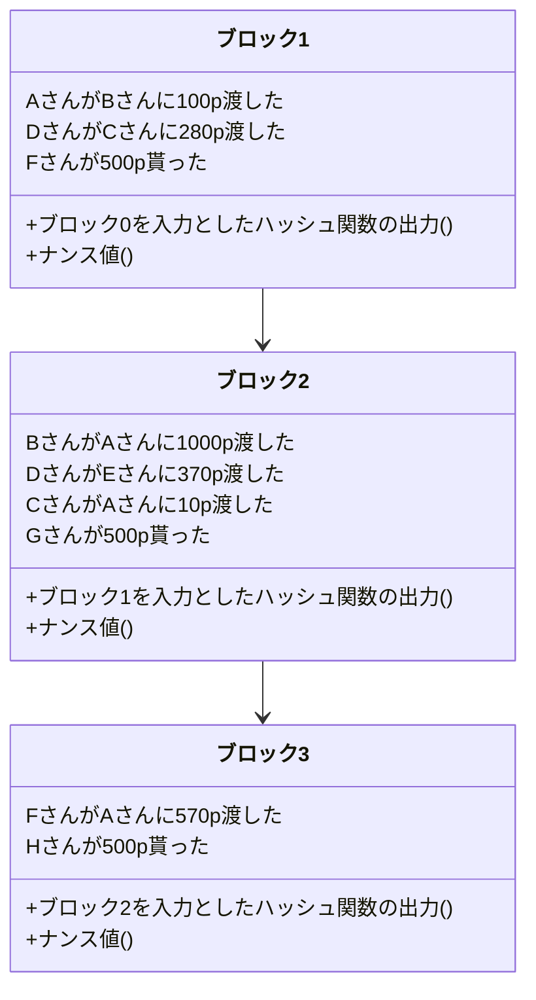

# 仮想通貨と電子決済の仕組み

僕は根来と言います。趣味でプログラミングをしていて、Webサイトやプログラミング言語を作っています。

まずは仮想通貨の仕組みについて説明していきます。仮想通貨に管理にはブロックチェーンという技術が使われています。そのブロックチェーンについて説明してきます。
そもそも、仮想通貨を実現するにはどうすればいいかというと、
「人がその通貨をやり取りしたことを正確に記録する信頼できる台帳」を作ればいいです。そうしたらそれぞれの人の持っている通貨の量を一意的かつ信頼を持って言うことができます。
しかし台帳を誰か特定の人(例えばサービス管理運営者が持っていると)、その運営者を信頼しないといけなくなって仮想通貨システムとして成立しないです。よってサービスを利用しているユーザー全員が共同で台帳を管理していちいち同期するようにすればいいというわけです。

ここで前提知識としてハッシュ関数を説明します。ハッシュ関数とは、様々なデータを入力値として与えると、0と1の数の並びが出力される関数です。
性質にはこんなものがあります。
1、入力値を少しでも変えると全く違うものが返ってくる。
2、ある01の並びを出力するような入力を答える時に、「いろんな入力をしてみてその並びと等しいものを探す」という方法より効率的な方法をまだ人類が知らない。
イメージは素因数分解です。
例えば、37*31=1147だったら暗算はできなくても筆算を書いたらすぐすることができます。しかし、1147の素因数は？という問いに答えるのは結構大変です。具体的には割る2・割る3・割る5というように小さい素数から割り切れるかを確認していく必要があります。sqrt(1147)までの素数で全て割り算したら絶対に1147がどのように素因数分解されるかを言うことができます。よって入力される大きな素数っぽい数のスケールの二乗根に比例した回数の割り算をしないといけなくなります。しかし逆向きは1回の計算で済みます。
ちなみに素因数分解と今回システムに使っているハッシュ関数(SHA256と言う)は全く関係ないですが、素因数分解を利用した暗号化技術にRSA暗号があり、Webサイトなどにアクセスする時にも実際に使われています。ちなみに量子コンピュータが話題になっているのは、「ある01の並びを出力するような入力を答える」問題を効率的に解ける(あくまでも)可能性があるからです。

話を戻しましょう。ブロックチェーンとは一言で言うなら「台帳を安全に管理する仕組み」です。台帳とはここでは仮想通貨の所有者の取引の記録です。具体的には以下のようなものです。
```
AさんがBさんに100p渡した
DさんがCさんに280p渡した
```

このような台帳が改竄されていない



何回か取引をすると取引の記録が残ります。それらの取引の記録(＝台帳)を安全に管理したいというわけです。


ブロックの中には、複数の通貨のやり取りの記録と、一個前のブロックを入力とした時のハッシュ関数の出力(ハッシュ)と、ハッシュがたまたま00000から始まるハッシュ関数の入力(ナンス値)が入っています。

<!--stackedit_data:
eyJoaXN0b3J5IjpbMTQ5NTMwNjA4MiwtMTc3MjIxODczNF19
-->