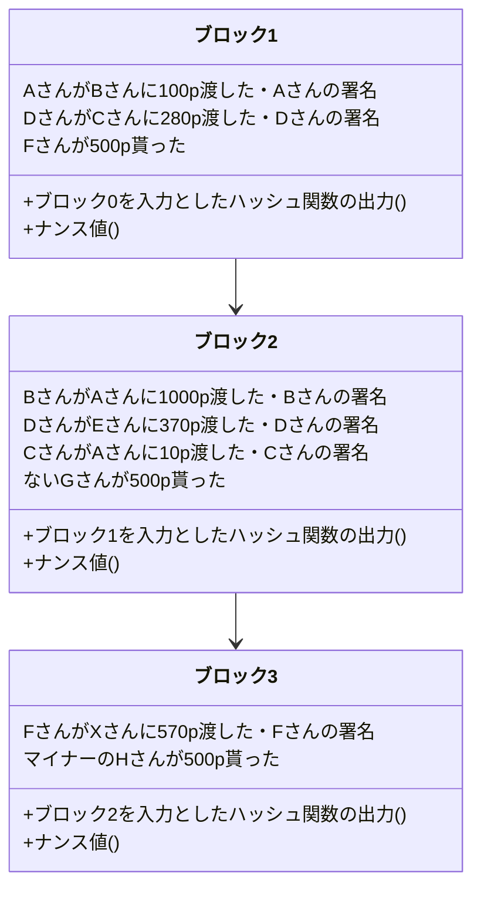
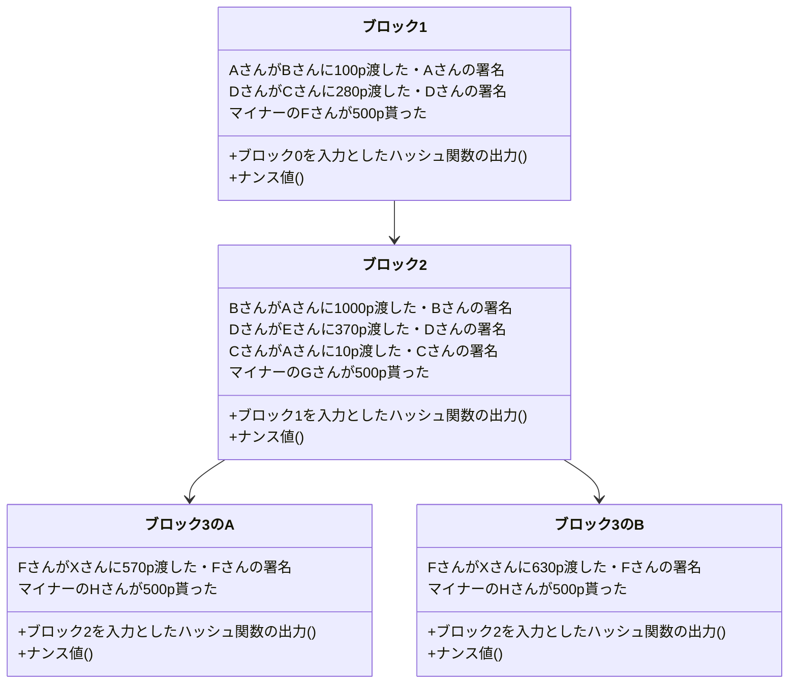

# 仮想通貨と電子決済の仕組み

趣味でプログラミングをしていて、Webサイトやプログラミング言語を作っています。

まずは仮想通貨の仕組みについて説明していきます。仮想通貨に管理にはブロックチェーンという技術が使われています。そのブロックチェーンについて説明してきます。
そもそも、仮想通貨を実現するにはどうすればいいかというと、
「人がその通貨をやり取りしたことを正確に記録する信頼できる台帳」を作ればいいです。そうしたらそれぞれの人の持っている通貨の量を一意的かつ信頼を持って言うことができます。
しかし台帳を誰か特定の人(例えばサービス管理運営者が持っていると)、その運営者を信頼しないといけなくなって仮想通貨システムとして成立しないです。よってサービスを利用しているユーザー全員が共同で台帳を管理していちいち同期するようにすればいいというわけです。

ここで前提知識としてハッシュ関数を説明します。ハッシュ関数とは、様々なデータを入力値として与えると、0と1の数の並びが出力される関数です。
性質にはこんなものがあります。
1、入力値を少しでも変えると全く違うものが返ってくる。
2、ある01の並びを出力するような入力を答える時に、「いろんな入力をしてみてその並びと等しいものを探す」という方法より効率的な方法をまだ人類が知らない。
イメージは素因数分解です。
例えば、37*31=1147だったら暗算はできなくても筆算を書いたらすぐすることができます。しかし、1147の素因数は？という問いに答えるのは結構大変です。具体的には割る2・割る3・割る5というように小さい素数から割り切れるかを確認していく必要があります。sqrt(1147)までの素数で全て割り算したら絶対に1147がどのように素因数分解されるかを言うことができます。よって入力される大きな素数っぽい数のスケールの二乗根に比例した回数の割り算をしないといけなくなります。しかし逆向きは1回の計算で済みます。
ちなみに素因数分解と今回システムに使っているハッシュ関数(SHA256と言う)は全く関係ないですが、素因数分解を利用した暗号化技術にRSA暗号があり、Webサイトなどにアクセスする時にも実際に使われています。ちなみに量子コンピュータが話題になっているのは、「ある01の並びを出力するような入力を答える」問題を効率的に解ける(あくまでも)可能性があるからです。

今度は公開鍵暗号について説明します。一般的に思いつく暗号化の方法は、秘密鍵暗号と呼ばれるもので次のように行われます。秘密鍵暗号では「平文→暗号」と「暗号→平文」は同じ鍵を使って行います。秘密鍵が漏れると解読されてしまいますから、どうにか最初に秘密鍵を何らかの安全な環境で送り届ける必要があります。これとは対照的に公開鍵暗号では、「平文→暗号」と「暗号→平文」は異なる鍵で行います。「平文→暗号」には公開鍵を、「暗号→平文」には秘密鍵を使います。さっきのハッシュ関数と同じように、暗号化はできるけどその暗号を解読しろといわれてもいろんな平文を暗号化してみるという方法よりも効率的な暗号の解き方が存在しないというものです。そうするとそもそもバレたら困る鍵を渡す必要がありませんから安全というわけです。現実的にはこの公開鍵暗号は計算に大変な時間がかかるので、秘密鍵暗号の秘密鍵だけ公開鍵暗号で安全に届けそのあとは秘密鍵暗号で通信するというハイブリッドな方法が使われています。

まずは前提知識としてデジタル署名について解説します。デジタル署名とは「誰かが承認していることを証明するもの」です。デジタル署名はハッシュ関数を使って実現できます。Aさんが承認しているということをBさんが確認するということを考えると、次のようなアルゴリズムでデジタル署名が行われます。
ここでは、
- 署名は鍵があればすぐに生成することができる
- 署名は鍵がなければ生成することは難しい
- 署名は鍵がなくてもそれが正しいことがすぐわかる

ような関数`f`を使います。

`※一部説明の都合上簡略化しています。`

1. Aさんが関数`f`と鍵を使って「承認した」という旨のメッセージを署名にし、公開します。
2. 署名をBさんが見て関数`f`を使って正しさを証明できます。なぜなら正しい署名を作れる人はAさんだけだからです。

それでは、これからブロックチェーンというアイデアを再発明していきましょう。そのステップを見ることでこのアイデアの素晴らしさがわかってくると思います。

まずは台帳を署名を使って作っていくということを考えてみます。台帳とはここでは仮想通貨の所有者の取引の記録です。具体的には以下のようなものです。
```
- AさんがBさんに100p渡した
- DさんがCさんに280p渡した
```
これらをどこかに溜めていきます。そうしたら全ての取引を正しくきちんと把握することができるようになるはずです。しかしこのメカニズムには致命的な欠陥が複数あります。
- 中央集権的であること。
- 順序がわからないこと。

中央集権的であるとそれ用のサーバーを使っている人が不正をしていないことを証明するのが非常に難しくなります。新しい取引を勝手に作ることはデジタル署名的に不可能だったとしても何らかの取引を隠蔽することは簡単にできてしまいます。またもしこのサーバーが落ちたら仮想通貨は使えなくなってしまいますし、多大な運用コストがかかります。

また、順序がわからないと残金が100pなのに、40pと80pの買い物を同時にすることが可能になります。どちらかができないようになるべきですが、それを防ぐ方法がありません。逆にいうと順序を保証できたらこの問題は解決します。

よって仮想通貨を使う人全員で、順序を持った台帳のコピーを持ち合いそれぞれが正しさを検証すれば良さそうです。しかしそれでは誰かが「自分が100pもらう」という取引を勝手に追加したときに、それが広がってしまいます。またほとんど同時に行われた取引の順序を決めることが難しいです。

そこでブロックチェーンを導入します。

ブロックチェーンとは一言で言うなら「台帳を全員で安全に管理する仕組み」です。
```
AさんがBさんに100p渡した
DさんがCさんに280p渡した
```

このような台帳があれば誰が何p持っているのかわかります。しかしその台帳が正しいことをみんなで保証しようという仕組みが必要です。

ひとまずなぜこのようなルールなのかわかなくてもいいので、全体像を把握しましょう。

台帳をひとまとまりに分けてブロックという単位で管理することにします。ブロックの中には、以下の図のように複数の通貨のやり取りの記録それに対応するデジタル署名と、一個前のブロックを入力とした時のハッシュ関数の出力(ハッシュ)と、ハッシュがたまたま00000から始まるハッシュ関数の入力(ナンス値)が入ることにします。
実はこのブロックの列(ブロックチェーン)は枝分かれすることもありますが、クライアント(仮想通貨を使う人)は最も長いブロックチェーンを信用します。



さて、この構造にしたらなぜこの台帳が改竄されていないことがわかるのかを説明していきます。
まずはブロックの`k`番目について考えていきます。

`k`番目のブロックには、`k-1`番目のブロックのハッシュ値及び取引情報(コンテンツ)が最初に入っています。コンテンツの長さが一定の数値を超えるとナンス値が生成されます。コンピュータ資源を活用して頑張ってたまたま00000から始まるハッシュ値の入力側を探します。この操作はマイニングと呼ばれます。マイニングをしているマイナーは世界にたくさんいて、早い者勝ちで自分の作ったナンス値をブロックの中に入れることができます。ナンス値が見つかったら今度は`k`番目のブロックのハッシュ値が取られて取引情報がどんどん書き込まれていきます。その後は同じ手順です。この時マイナーのなかで最初にナンス値を見つけられた人は一定の仮想通貨上での金額を受け取ることができます。なのでみんなマイニングをしようとするわけですね。これは仕組み上必須なことと捉えることもできますが、仮想通貨の発行源と見ることもできます。ちなみにこの時、具体的な情報を何も提供していないのにマイニングをしたことが証明されているのでこれは不思議だということで「プルーフオブワーク」と言われています。

台帳を改竄するには、正しいブロックチェーンとは別の、自分が有利なコンテンツを書き込んだブロックチェーンを作る必要があります。しかし、それは先ほど説明したデジタル署名の仕組みによって不可能になっています。

ではデジタル署名だけでは解決できなかった存在保証と順序性の保証をどう解決するかを解説します。例えばたまたま同時にブロックが繋げられ、分岐してしまったとします。



そうすると、


<!--stackedit_data:
eyJoaXN0b3J5IjpbMzIxOTQwNjg1LDExNTAwMjg4MjUsLTE3ND
k3NDQzMjIsLTE3NzIyMTg3MzRdfQ==
-->