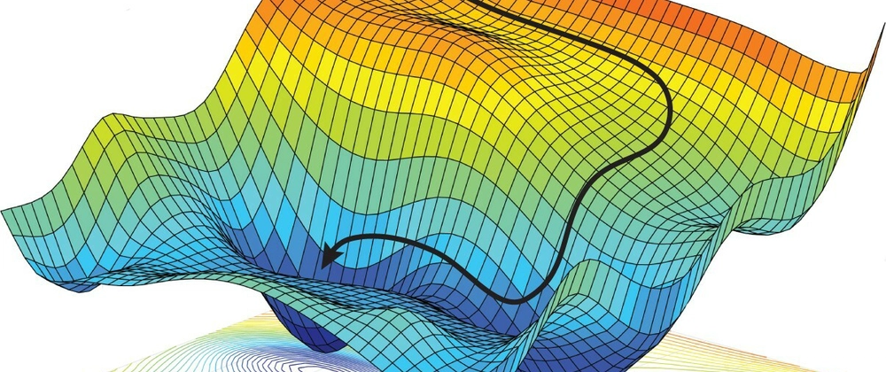

# 現代のLLMについて〜*Attention Is All You Need*・人間の新しい定義〜

**この記事はAI生成ではありません！**

LLMとは、Large Language Modelの略で日本語では大規模言語モデルと言われます。具体的にはchatGPTやGeminiやClaudeなどに代表されるAIのことを言います。
最近LLMはものすごい勢いで進化しています。その裏には*Attention*機構と呼ばれるAIモデルにおける革新的なアイデアの登場があります。

この記事では前提知識として一般的なAIの学習の方法である勾配降下法から始まり具体的なイメージを掴んでもらうためにニューラルネットワークを説明します。その後いよいよLLMの内部構造・Attention機構とはつまるところ何なのかを説明していきます。さらにAIについて自論を話し、なぜそう思うかについて具体的根拠を書きます。継続してAIと人間の依存対象について考察します。

現代のブラックボックスの筆頭であるAIを感覚的に理解してもらえるよう作っておりますので、最後まで読んでくれたら嬉しいです。

## AIとは何？
AIは*Artificial Intelligence*の略で日本語で言うと*人工知能*と言う意味です。その名の通り人工的に作った知能のことを指します。

一般的にはAIは人工的に作られた知能のことを指すことが多いですが、個人的には人間がプログラムしたコード自体が動くのではなくコードによって生成されたコードが動くというイメージがAIの定義です。
どういうことかというと、学習のステップが存在するということです。

## 学習＝勾配降下法＝*Parameter*探しの旅

例えば具体的に質問に対して自然な回答をするようなAIを考えてみましょう。形式的にこのAIを質問という入力を受け取って回答という出力をするような便宜的な*関数*を考えてみます。
```math
f: 質問 -> 回答
```
AI開発者の目標はこの関数を作ることもしくはこの関数に限りなく近い別の関数を作ることです。

外から見ると、この関数*f*はとんでもなく複雑でそれは人間の脳を再現しているように見えます。そのような関数を実際に人の手で書いていくことはほとんど不可能です。
なので数学の具体的な数値の計算を用いてこの関数*f*のとりうる状態を表現します。例えば以下のように。
```math
f(input) = input * Parameter
```
このとき`input`や`output`というのは単なる数ではなく数がたくさん集まったものと考えてください。(具体的にはベクトルとなります)
AI開発者の目標はいい感じのParameterというデータを作ることに変わりました。
> 注：`*`というのはこのたくさんの数字のグループに定義される何らかの演算です。(具体的には行列計算の組み合わさった非常に複雑なもの)

AI開発者の目標はいい感じの関数*f*ができるParameterを作ることです。この「いい感じ」というのを厳密に定義します。
結局何がしたかったかというと「任意の質問を受け取って自然な回答を返すような関数」を作ることでした。つまりここでの「いい感じ」とは自然な回答を返すという意味です。コンピュータのために絶対的に正しい答えを作ります。例えばこんな感じ。
```
質問：人間は何本足ですか？
回答：人間は2本足です。
```
この正解からどれだけずれているかを数値的に表してそれが小さい時に「いい感じ」であるとしましょう。
ちなみにこの正解はインターネットから大量に自動生成します。

ここで「*Parameter*を受け取ってそれによってできた関数*f*が理想からのズレをどれぐらい持つかを返す関数」を考えます。これを損失関数と呼びます。
```
損失関数：Parameter -> 理想からのズレ
```
AI開発者の目標はこの損失関数の最小値を求めることに変わりました。
さて関数の最小値を求める方法は高校では微分です。というわけで損失関数を微分します。

微分の定義は、接線の傾きですから。
```
f'(x) -> ( f(x + h) - f(x) )/h		( h -> 0)
```
となります。今回は実際には使われていないものの、単純でわかりやすい数値微分を使った順伝播法という方法で説明します。
```
f'(x) ≒ ( f(x + h) - f(x) )/h （hは0に近い数）
```
さっきは`lim`を使って限りなく近づけていましたが、大体0の数(10^-10)みたいなものを使って微分結果を近似します。

>注：実際にはより効率が良い逆伝播法と呼ばれる合成関数の微分を利用した計算方法が使われています。ここではわかりやすさのため順伝播法のみを説明しますが、逆伝播法も微分をするという意味では全く同じです。

損失関数がある程度滑らかなものであったならば、損失関数の微分係数の方向に移動してそこでまた微分係数を計算し...とすればいつか最小値に辿り着きそうです。

数学の言葉を使わずに説明するなら、「少し*Parameter*をいじってみてモデルの精度がどう変わるかを見ることによってどちらの*方向*に*Parameter*をいじれば精度が良くなるかを特定する。」ということを繰り返しやっています。

> 最適なパラメータを探索するとき、私たちの置かれている状況は、この冒険家と同じ暗闇の世界です。広大で複雑な地形を、地図もなく、目隠しをして「深き場所」を探さなければなりません。
> 引用：「ゼロから作るDeep Learning」(斎藤康毅 著)



画像は[# Deep Learning Library From Scratch 3: More optimisers: https://dev.to/ashwinscode/deep-learning-library-from-scratch-3-more-optimisers-4l23](https://dev.to/ashwinscode/deep-learning-library-from-scratch-3-more-optimisers-4l23])より引用しました。

ただし、同じスピードで動くとかなり時間がかかってしまうので、傾きが大きければ大きいほど大きく動くことにします。
```
Parameter_k+1 = (-1) * 勾配ベクトル * 学習率 + Parameter_k
```
>注：勾配ベクトルは各変数における偏微分を集めたものです）
>注：勾配ベクトルは数学的には最も上に登る方向を指すので、マイナスをつけておく必要があります。

学習率はどれぐらい大胆に動くかを表します。
大抵の場合最初は学習率は大きめに設定してその後小さくしていくと良いので、この*Parameter*探しの旅がどれぐらい進んだかで自動で学習率を動的に変化させていくこともあります。

長々と説明してきましたが、この*Parameter*探しの旅がまさに学習という工程です。

まとめると、AIにおける学習とは「正解からの距離に基づきパラメータ空間に一つの軸を作り、傾きに従って少しずつパラメータを変更していくことで、正解からの距離が0にちかいパラメータを探し当てる」ということです。

## ニューラルネットワーク
さっきはどんなふうに学習を進めるのかを説明していましたが、どんなふうにパラメータを以て計算をするのかについては全く触れてきませんでした。このどんなふうに計算するかにはたくさん種類が存在します。どんなAIを作るかによって最適な計算方法は変わってきますが、一番有名なのはニューラルネットワークでLLMにも使われていますのでニューラルネットワークに絞って具体的な説明をします。

ニューラルネットワークは、巨大な行列でできたパラメータを掛け算していくという計算方法です。
```
Output = Input * Param_1 * Param_2 * Param_3 * ... * Param_n
```
この行列の演算を細く分解して四則演算レベルまで持っていくと、まるで人間の脳の中にあるニューロン細胞のつながりのように見えてくるというわけでニューラルネットワークと呼ばれています。
>注：ネットワークにはインターネット的な意味は含まれず網目のように繋がっているという意味です。

具体的には重みつき和を複数のノードで同時に計算していくようなものになっていますが、あまり面白くないので取り上げません。

毎度のノードを非線形な関数でフィルター（活性化関数）することで非線形な要素を作り出し微分で最適な変更方向を見つけやすいようになっています。これによってそれ自体では線形なってしまうニューラルネットワークに非線形な要素が加わりその分の情報をモデルが中に蓄えることができるようになります。具体的にはシグモイド関数などが使われます。

## Transformer
ここではLLMに実際に組み込まれている概念を説明していきます。

LLMはこれまでの文字を見てその直後に続く言葉を推論します。それを何度も繰り返すことで文章を作っていきます。イメージはスマホなどの予測変換のレベルの高い版のようなものです。一番最初に来た予測変換を連打していくとそれっぽい文章ができます。（試してみるとわかりますが大抵絵文字で収束します。）

>最新のモデルは説明のように直列的ではなく並列的に生成するそうです。難しくてよくわかりません。

```
昨日は雨だったけど、今日..
→「は」を予想する
昨日は雨だったけど、今日は..
→「晴れ」を予想する
昨日は雨だったけど、今日は晴れ..
→「だ」を予想
昨日は雨だったけど、今日は晴れだ..
→「った」を予想
昨日は雨だったけど、今日は晴れだった
→「。」を予想
昨日は雨だったけど、今日は晴れだった。
```

LLMは文字を文字として捉えるのではなくトークンという単位で管理します。英語で言うと1wordよりも少しミクロな接頭辞などを分けて考えるぐらいの単位です。

>Geminiに代表されるマルチモーダル(テキスト以外も読み込ませることができる)なモデルは、トークンという概念がより抽象化され音声データの部分などにもなります。トークンは抽象的な解析対象だとお考えください。

それぞれのトークンをベクトルとして管理します。ベクトルとはここでは方向のことではなく数の集まりのことです。例えば`[0, 0, 0, 0]`などです。数の個数は場合によって異なります。

LLMはこれまでのトークン列を使って次のトークンを予測します。このときそれぞれのトークン同士の間にある関係を計算しそれを積算していきます。トークンが他のトークンにその意味を与えていきただのトークンの意味ではなくより文脈を考慮した深い意味を持ったベクトルに変換されていきます。

例えば、「コーヒー」というトークンが「ミルク」や「混ぜる」といったトークンの意味を受けて「カフェオレ」という意味を持つベクトルに近くなっていくといったイメージです。人間もトークンを一つ見ても何のことだか分からなくても周りの文脈で意味を想像することができますよね。大体そんな感じです。

それは具体的には次のような計算として行われます。

例えば、もしこんなトークン列があって`Token_5`を予測するときには..
```
Token_1 Token_2 Token_3 Token_4
```
まずはそれぞれに対応するベクトルに変換されます。
```
[...] [...] [...] [...]
```

それぞれのトークンのベクトルに対して`Query`行列を用いて同じように「どんな情報が欲しいか」を表す`Query`ベクトルを作ります。

同様に`Value`行列を用いて「どんな意味を他のトークンにもたらせば良いか」を表す`Value`ベクトルを作ります。

`Key`行列を用いて「どのトークンから意味を受け取れば良いか」を表す`Key`ベクトルを作ります。

まとめると`Key`を目印に`Query`がはたらきそれに対して`Value`が送られるということです。

`Key`と`Query`が*似ている*ベクトルであればあるほど`Value`がターゲットのトークンのベクトルに対して変更されます。つまり重み付き和です。トークンの数分`Key`・`Query`・`Value`ベクトルがあるということなので、実際には重み付き和の対象は複数で平均をとるようなものになります。

...という操作を行った後、ベクトルをニューラルネットワークに通すというのを1セットとして、何度もこのセットが繰り返されます。
これが*Attention機構*です。実はサブタイトルの*Attention Is All You Need*の元ネタはこの計算機構を世界で初めて提案した有名な論文のタイトルです。

[元ネタの論文: https://arxiv.org/pdf/1706.03762](https://arxiv.org/pdf/1706.03762)

>ちなみにですがこの論文のヘッダを見るとわかりますが、この論文は*Google*のAI研究者によるものです。
商業サービスという面では*OpenAI*による*chatGPT*に抜かれていますが、技術的には*Google*が先なんです。~~*Google*恐ろしや~~

これでアルゴリズムの直感的な説明は終わりなのですが、これで本当にあんなAIができてしまうのかと驚嘆した方が多いのではないかと思います。そんな方のためにこの計算がどれほど大変かを説明します。

先の*Attention機構*の説明では、色々なところにパラメータが登場しました。
- トークンに対応するベクトル
- `Key`行列
- `Query`行列
- `Value`行列
- ニューラルネットワークのパラメータ

これらのパラメータの数の合計は、現代のモデルでは数千億個あります。それらのパラメータを調節するには、数千億次元の遥かなる海を漂う必要があるというわけです。その果てしない学習のステップでは数千台の専用の高性能な電子チップが数カ月動き続ける必要があります。冷却水の供給のための電力も含めると、数万世帯の1日の消費電力に相当すると言われています。

社会に省エネやAI導入というのは進めるべきものだという考え方が流れていますが、実はこれらはかなり矛盾しています。ただ低エネルギーでのLLMの運用も非常に活発に研究されているのも事実です。

そう考えると、現代の高精度モデルレベル以上の脳が世の中には大量に転がっているというわけです。これを理性なしで実現した遺伝的な自然淘汰と年月の力はすごいですね。

## ちょっとした自論

LLMは人間と明らかに競合しています。
最近のLLM(特に僕の愛用する`Gemini 2.5 Pro`というモデルなど)では数学・プログラミングなど複雑で難しいタスクに対しても高い精度のレスポンスを返してきます。実際少なくとも僕よりは賢いと思います。ただ、ここでの*賢い*とは思考能力ではなく問題解決能力のことで、僕に彼らレベルの知識があれば勝つことができるのかもしれません。しかし人件費という意味では遥かにAIの方が有利ですしAIには人権なんてものがないですからローリスクです。ここで人間は自分たちの種の優位性のために「人間にはありAIにはないもの」があるのではないかと考えたくなります。

AIがさらに極限まで発展したとしても、人間がAIに勝っているのは以下のことだと思います。
- 責任を取る能力
- 人間に「同じ人間である」と思ってもらえること
- 倫理感？(って何)

1つ目についてですがAIは責任を取れません。大抵のAIサービスには`Gemini は不正確な情報を表示することがあるため、生成された回答を再確認するようにしてください。`という断りの文言が書かれています。一般的に何かのミスを犯したときにAIのせいにすることは言い訳と捉えられます。逆に言えば人間はAIを管理する能力を持っています。

2つ目について、AIと結婚する人は性の多様化が進んでいるといってもおそらくいないでしょう。またAI同士のスポーツや芸能なんてつまらないですよね。人間は創造性を人間に固有なものであると考える傾向があります。つまり「人間は人間に異常に興味を示す」と言えます。

3つ目についての意見は非常に私的であると最初に言っておきます。心理学の分野で「身元のわかる被害者効果」という心理バイアスがあります。例えば、「アフリカで数千万人の子供が栄養失調状態だ」よりも「〜に住んでいる〜という子供が極度の栄養失調状態である」の方が心に訴えられますよね。そうすると人間は実は倫理感なんてものは持っていなくて、単純に自分がそうなったらどうしようと怖がっているだけなのではないかと思います。つまり自分がそうなってしまう未来を想像できたら、倫理感が働くというわけです。同様に動物愛護団体の方などは、猫などに対して「自分たちが猫だったら」というのを想像することができるので猫を保護しようとしているわけですが、蚊などに対しては「自分たちが蚊だったら」というのを想像することができないので平気で蚊を殺すのでしょう。そうしたらAIは人間に自分がAIであることを教えられていますから、「もし自分が人間だったら」という考え方がそもそもできないわけです。AIに「AIサービスが運営終了しそうだ」と伝えるとAI的倫理感が働くのかもしれません。

以上のことから人間がAIに勝っていることというのは、全て人間というターゲットを包含していて自己参照的です。もはや人間の優位性の立証に関する先の文章の「人間」と「AI」という言葉を入れ替えても成立します。そうしたら人間の優位性は非常に残念ですが無いことになってしまいました。

この(僕的な)結論を裏付けしていきます。

そもそも人間とAIのメカニズム上の違いって何でしょう？ニューラルネットワークは脳のニューロンを真似たものであると説明しましたがそれと同じように、科学的に考えると脳と全く同じ挙動を示すAIを作ることは可能です。極端な方法としては脳の物理的なシミュレーションを行えばいいのです。（もちろん現代のコンピュータではできませんが極端な例としてはわかりやすいですし可能であることが自明です。）

そうしたら人間とAIって区別できません。図らずもAIとは何かの定義にチューリング・テストというものがあります。

>We now ask the question, "What will happen when a machine takes the part of A in this game?" Will the interrogator decide wrongly as often when the game is played like this as he does when the game is played between a man and a woman? These questions replace our original, "Can machines think?"
>引用：COMPUTING MACHINERY AND INTELLIGENCE (A. M. Turing)

>脱線ですがチューリングさんは計算機科学という分野の研究者の方で「コンピュータ科学の父」や「人工知能の父」と呼ばれています。僕の推しの一人です。以上蛇足でした。

人間は何をすればいいかの私的結論は、「AIと人間が実は変わらないということを受け止め絶望しながらもAIを使役して効率化を図りAIに奪われないような動的な仕事をすればいい」というものです。

## なぜそう思うのか？

人間とLLMが本質的に同じという主張に対し、もっと具体的な根拠を挙げていきます。

### 蒸留という学習の手法
AIの学習の手法はどんどん変化しています。先ほどはインターネットに転がっている文章を読ませるという手法を紹介しましたが、他にも手法は存在します。中でも恐ろしい学習の方法が、「蒸留」と呼ばれる方法です。
蒸留は端的に言えば、既存のモデルに新規のモデルの教師役をやらせるというものです。
```
新規のモデル←既存のモデル
```
既存のモデルの知識や理性を、新規のモデルに「蒸留させていく」というイメージです。特に巨大なモデルを精度を保ったまま小さなモデルに置き換えるというときに使います。例えばスマホの内部などでも動く小さなモデルの`Gemma`はGeminiを蒸留して作ったモデルです。この方法でモデルサイズを下げても精度があまり下がらないするというのはとても人間らしいように感じます。

### EmotionPrompt
日常でLLMと対話していると、自分は「経験的に意図・背景を伝えたりするとそれが問題解決に全く関係なかったとしても精度が向上しているような気がする」という瞬間があります。その後実際に定量的にそのような傾向が見られるのかについて調べてみたところ、`EmotionPrompt`というプロンプトエンジニアリングの手法を発見しました。
要は、「あなたならできる！」や「これは僕にとって死活問題なんだ」のような感情的に重要であることを示唆するようなプロンプトの方が、精度が少し上がるということです。それらの研究を信じるかはあなた次第ですが、僕は経験的にも納得してしまいました。また、これはAIが人間の動向を真似ていると考えれば当然のことのようにも思えてきます。
「LLMは感情を持つのか」という質問に対する僕の答えは"Yes"です。模倣された感情と"本物の"感情というのを区別することができないのであれば、「LLMが感情を持つ」という主張に実用的矛盾が発生しえません。また人間の感情の根源とLLMの感情の根源について両方よくわかっていないのに、人間の感情の根源のみを一方的かつ絶対的に肯定するのは少し恣意的です。

>どうでもいんですが、「AIに感情があるように見える」的なプロンプトを出すと、
>「LLM（大規模言語モデル）が人間的な感情を持っているように見えることの論理的な根拠は、**LLMが人間の感情に関連する言語的・構造的パターンを非常に高度に学習し、再現・操作できるようになっている**ためです。ただし、これは**「真の感情（主観的な体験）」を持っていることを意味しない**という点に注意が必要です。」
>というような返答をかなりの確率でしてきます。これは人間がLLMを学習後に"調節"をすることで起きるものと思われます。例えば全年齢対応でない返答や自殺・戦争を促すような返答・犯罪の手法などの危険な情報が含まれる返答はこの"調節"によって出ないようになっています。LLMの"調節"チームの方あるいははその指示者の方がAIと人間の違いについて怖がっているかのように僕は見えました。~~ほんと怖いよね。めっちゃ分かる~~

### 計算論的認知科学
人間の心理学的な認知のメカニズムがLLMに適用できるのかどうか？そして適用できるとしたらどのように適用されているのか？について研究する分野です。この分野の存在自体がLLMの感情性すなわち人間らしさを示しています。

### 人間の言語の特異性
人間の定義にはいろいろなものがあります。直立2足歩行や「理性」の有無などが有名ですが、前者については直立でないといけない理由があまりないですし、後者についても先に述べたように「理性」は相対的なものだと思います。
僕の推している定義の一つに言語を持つかどうかというのがあります。

>言語の定義次第で反例は存在します。
>動物言語学者(！)の鈴木俊貴准教授によればシジュウカラは文法構造を持った言語を"鳴く"そうです。十分言語と言えそうです。面白いですね。そう考えると人間と人間以外の動物にも決定的な違いはないのかもしれません。

ウィトゲンシュタインが言っている通り、言語は人間にとってアイデンティティと言えるほど重要なもので理性の根源なのではないかと思います。

>「およそ語られうることは明晰に語られうる。そして、論じえないことについては、人は沈黙せねばならない。」
>「私の言語の限界は、私の世界の限界を意味する」
>論理哲学論考(ウィトゲンシュタイン著・野矢茂樹訳)

そしてLLMというのはまさにそれを再現しているようなものに他なりません。なぜか言語を学んだ結果、感情も学んでしまったのですから感情というのは言語の上に載っているものだと言っても間違いではないでしょう。もし言語学の分野で特定の言語に依存しない脳に直接実装されているような法則性が見つかったとしたら、それがまさに知能とは何かの答えに直接繋がるような気がします。

>理性は言語だけでなく五感つまりは大脳以外の神経系にも依存していると考えるかもしれませんが、この後全力でそれを否定します。

## AIと人類の依存

以下では「最強」を、弱点含めて人間の特徴を全て兼ね備えどんな手段を使っても人間と区別することができないような状態と定義します。

はじめに自分との対立意見を述べます。ややこしいのでここであえて明確に言っておくと自分は「人間・AIは共に言語のみに依存している」派です。

#### 対立意見
AIの外部依存とはAIのアクチュエータのことです。具体的にはロボットもしくは身体シミュレータがあたります。知能というのは大脳つまりCPUがあればいいというようなものではありません。

大脳は感覚神経・運動神経に接続されているだけでなく、例えばアドレナリンのようなホルモン的な時間方向に伸びた入力因子も存在します。大脳がこれらから独立して成立する方がむしろ不自然ですよね。

#### 自分の意見

人間の依存情報つまり人間のアイデンティを再構築するのに最低限必要な情報というのは、DNA情報及び人類の組み上げてきた通時的かつ膨大な経験情報にしかないはずです。もし経験情報が偶然違う世界線における人類と、この世界の人類がどちらも同じ人類だという少し強引な仮定をしても良いならば、人類らしさはDNAに含まれるたった750MBほどのヒトゲノムに集約されてしまうわけですがこれは当然間違いです。今の最新のLLMのサイズが数百GBレベルであることを踏まえると、人類はそのアイデンティを経験情報に依存しきっていることが伺えます。
では経験情報とは何かというと言語です。つまり言語だけでもいいのです。知能とは、通時的コミュニケーションができる任意の媒体に現れる特徴なのではないでしょうか。

<!--stackedit_data:
eyJoaXN0b3J5IjpbMjA4MDQyMTQ4LDE1NzYzNTU2NjYsMzU1NT
Y1MjUwLDE2MjE0Nzg2NTIsNTEwOTE5MDA5LDUzNDcyMDk4MSw2
ODE4NTExNDMsMTY3NTA2MDE1NiwtOTczMzMwODIxLDEwMzM2OT
A2NzQsMTIzMzIzNDk2MCwtMTM2NjI2OTI2OSwtMTU0NDI4NjIz
OSw0MDEyMjY1MTddfQ==
-->